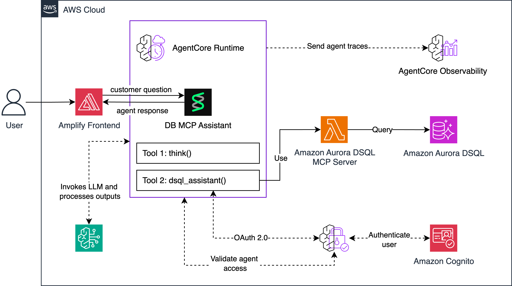
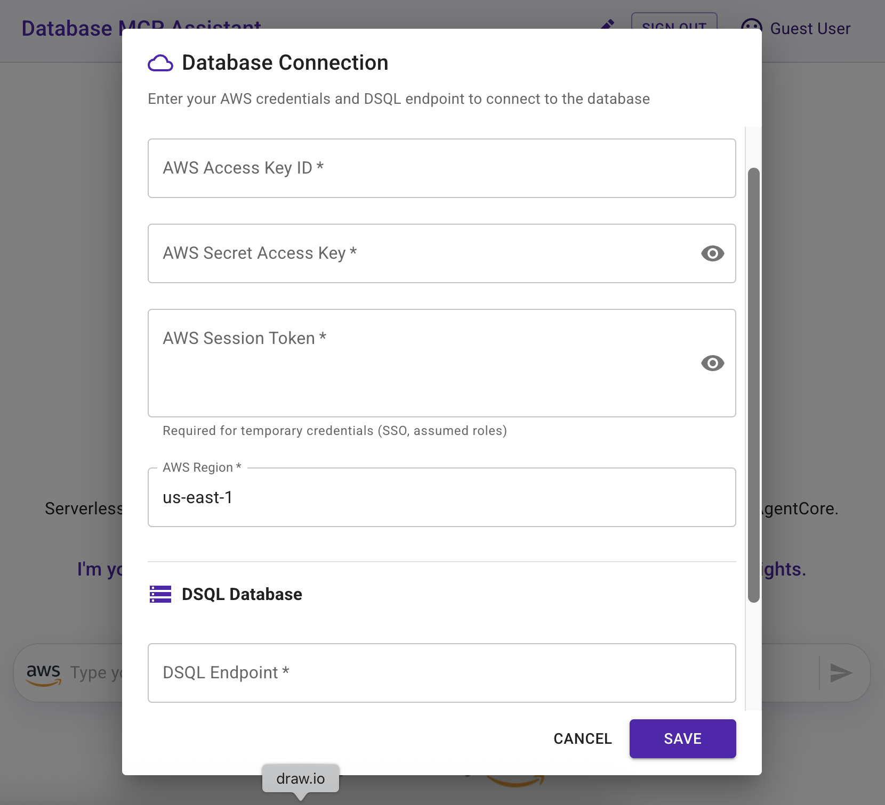
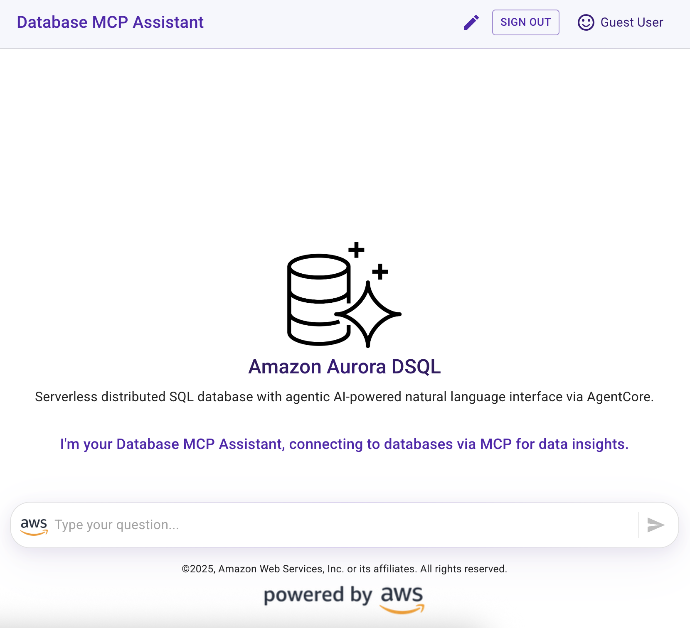

# Deploying a DB MCP Assistant Solution with Amazon Bedrock AgentCore

This solution provides a Generative AI application reference that allows users to interact with databases through a natural language interface using MCP (Model Context Protocol). The solution leverages **[AWS Bedrock AgentCore](https://aws.amazon.com/bedrock/agentcore/)**, a managed service that enables you to deploy, run, and scale custom agent applications, along with the **[Strands Agents SDK](https://strandsagents.com/)** to build an agent that connects to databases via MCP servers, providing data analysis capabilities through a web application interface.

<div align="center">

</div>

🤖 A DB MCP Assistant offers an approach to database analysis that enables enterprises to interact with their databases through natural language conversations using MCP (Model Context Protocol) rather than complex SQL queries. This kind of assistant provides an intuitive question-answering interface for database analysis and can be improved by offering data visualizations to enhance the user experience.

✨ This solution enables users to:

- Ask questions about database data in natural language
- Receive AI-generated responses based on SQL queries via MCP connections
- View query results in tabular format
- Explore data through automatically generated visualizations
- Get insights and analysis from the AI assistant
- Connect to various databases through MCP servers (DSQL, PostgreSQL, MySQL, etc.)

🚀 This reference solution can help you explore use cases like:

- Empower analysts with real-time business intelligence
- Provide quick answers to C-level executives for common business questions
- Unlock new revenue streams through data monetization (consumer behavior, audience segmentation)
- Optimize infrastructure through performance insights

## Solution Overview

The following architecture diagram illustrates a reference solution for a generative AI DB MCP assistant that is built using Strands Agents SDK and powered by Amazon Bedrock. This assistant enables users to access structured data that is stored in databases via MCP connections through a question-answering interface.


> [!IMPORTANT]
> This sample application is meant for demo purposes and is not production ready. Please make sure to validate the code with your organizations security best practices.

### AgentCore Runtime Infrastructure

**Amazon Bedrock AgentCore** is a fully managed service that enables you to deploy, run, and scale your custom agent applications with built-in runtime capabilities.

- **[Amazon Bedrock AgentCore Runtime](https://docs.aws.amazon.com/bedrock-agentcore/latest/devguide/agents-tools-runtime.html)**: Provides the managed execution environment with invocation endpoints (`/invocations`) and health monitoring (`/ping`) for your agent instances

The AgentCore infrastructure handles all runtime complexity and provides efficient execution without requiring developers to manage underlying infrastructure.

### CDK Infrastructure Deployment

The AWS CDK stack deploys and configures the following managed services:

- **IAM AgentCore Execution Role**: Provides necessary permissions for Amazon Bedrock AgentCore execution
- **VPC and Private Subnet**: Network isolation and security for database resources
- **Amazon Aurora Serverless PostgreSQL**: Stores the video game sales data with RDS Data API integration
- **Amazon DynamoDB**: Tracks raw query results and agent interactions
- **Parameter Store Configuration Management**: Securely manages application configuration

### Strands Agent Features

| Feature | Description |
|----------|----------|
| Native Tools   | current_time - A built-in Strands tool that provides the current date and time information based on user's timezone. |
| Custom Tools | get_tables_information - A custom tool that retrieves metadata about the database tables, including their structure, columns, and relationships, to help the agent understand the database schema.<br>execute_sql_query - A custom tool that allows the agent to run SQL queries against the PostgreSQL database based on the user's natural language questions, retrieving the requested data for analysis. |
| Model Provider | Amazon Bedrock |

> [!NOTE]
> This solution references the use of AWS IAM credentials to connect to Amazon Bedrock AgentCore and Amazon DynamoDB. 🚀 For production deployment, consider integrating Amazon Cognito or another identity provider for proper authentication and authorization instead of using IAM user credentials.

> [!TIP]
> You can also change the data source to connect to your preferred database engine by adapting the Agent's instructions and tool implementations.

> [!IMPORTANT] 
> Enhance AI safety and compliance by implementing **[Amazon Bedrock Guardrails](https://aws.amazon.com/bedrock/guardrails/)** for your AI applications with the seamless integration offered by **[Strands Agents SDK](https://strandsagents.com/latest/user-guide/safety-security/guardrails/)**.

The **user interaction workflow** operates as follows:

- The web application sends user business questions to the AgentCore Invoke
- The Strands Agent (powered by Claude 3.7 Sonnet) processes natural language and determines when to execute database queries
- The agent's built-in tools execute SQL queries against the database via MCP connections and formulate an answer to the question
- After the agent's response is received by the web application, the raw data query results are retrieved from the DynamoDB table to display both the answer and the corresponding records
- For chart generation, the application invokes a model (powered by Claude 3.5 Sonnet) to analyze the agent's answer and raw data query results to generate the necessary data to render an appropriate chart visualization

## Prerequisites

### AWS Credentials Setup

#### Option 1: AWS CloudShell (Recommended for Quick Testing)

For quick testing and deployment, you can use AWS CloudShell which provides temporary AWS credentials:

1. **Open AWS CloudShell** in your AWS Console
2. **Clone the repository**:
   ```bash
   git clone https://github.com/hcwongleo/db-mcp-assistant.git
   cd db-mcp-assistant
   ```
3. **Run the deployment script**:
   ```bash
   chmod +x deploy.sh
   ./deploy.sh
   ```

#### Option 2: Local Development with AWS CLI

For local development, configure your AWS credentials:

```bash
aws configure
# Enter your AWS Access Key ID, Secret Access Key, and preferred region
```

Or set environment variables:
```bash
export AWS_ACCESS_KEY_ID=your_access_key
export AWS_SECRET_ACCESS_KEY=your_secret_key
export AWS_SESSION_TOKEN=your_session_token  # if using temporary credentials
```

### Required Tools

- **AWS CLI** - [Installation Guide](https://docs.aws.amazon.com/cli/latest/userguide/getting-started-install.html)
- **AWS CDK** - Install with: `npm install -g aws-cdk`
- **Node.js 18+** - [Download](https://nodejs.org/)
- **Python 3.10+** - [Download](https://www.python.org/downloads/)

## Deployment Instructions

The deployment consists of three main steps:

1. **Back-End Deployment** - Data Source and Configuration Management Deployment with CDK
2. **Agent Deployment** - Strands Agent Infrastructure Deployment with AgentCore  
3. **Front-End Implementation** - Integrating AgentCore with a Ready-to-Use DB MCP Assistant Application

### Quick Deployment

Run the automated deployment script:

```bash
chmod +x deploy.sh
./deploy.sh
```

> [!NOTE]
> *It is recommended to use the Oregon (us-west-2) or N. Virginia (us-east-1) regions to deploy the application.*

> [!IMPORTANT] 
> Remember to clean up resources after testing to avoid unnecessary costs by following the clean-up steps provided.

## Application Features

The following images showcase the user experience flow:


- **Secure Authentication**: Users can create accounts and sign in securely



- **Credential Configuration**: Easy setup of AWS credentials and database endpoints



- **Conversational AI Interface**: Natural language interaction with databases through an intuitive chat interface